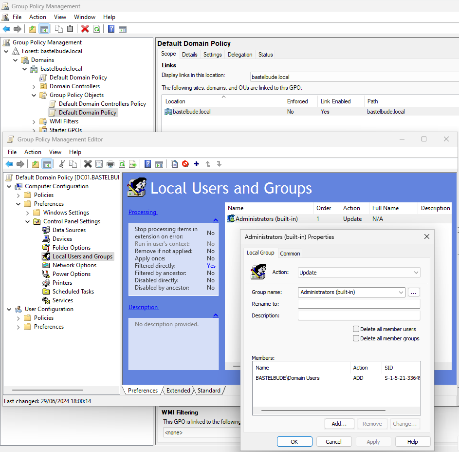
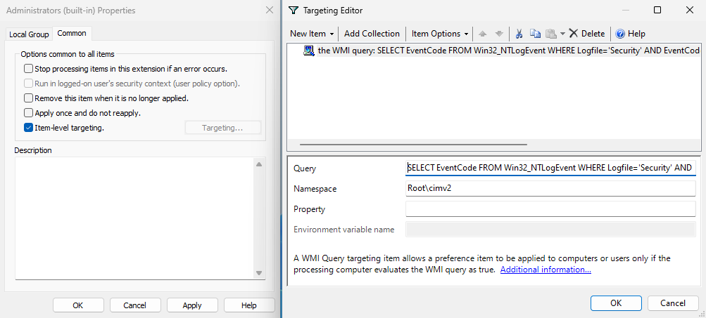
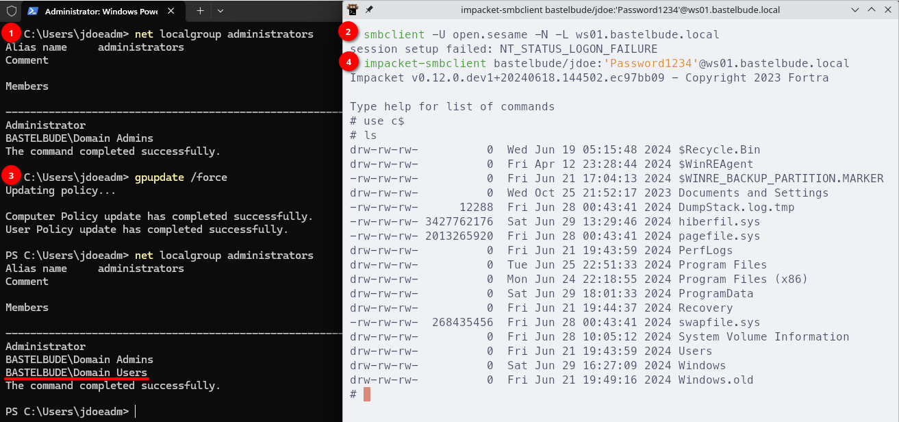

The list of Active Directory persistence techniques is already pretty long.
This blog post adds another one to that list.

The basic idea is this: Add a new Group Policy Preference (GPP) to an existing Group Policy Object (GPO).
Then configure this GPP to add a group like *Domain Users* to the local *Administrators* group.
Next enable item-level targeting on the GPP and configure a WMI filter that searches for failed logon events where the event message contains a specific string (*open.sesame* in the example below).

WMI query from screenshot above:

~~~ sql
SELECT EventCode FROM Win32_NTLogEvent WHERE Logfile='Security' AND EventCode=4625 AND Message LIKE '%open.sesame%'
~~~

The result of this GPO: An attacker can become local admin on any computer where the GPO applies by authenticating as user *open.sesame*.
On the next group policy update cycle, the WMI query will find the failed logon event and the GPP will be applied to the system.

# References

- [OUs and GPOs and WMI Filters, Oh My!](https://rastamouse.me/ous-and-gpos-and-wmi-filters-oh-my/) ([archive](https://web.archive.org/web/20240228124220/https://rastamouse.me/ous-and-gpos-and-wmi-filters-oh-my/))
