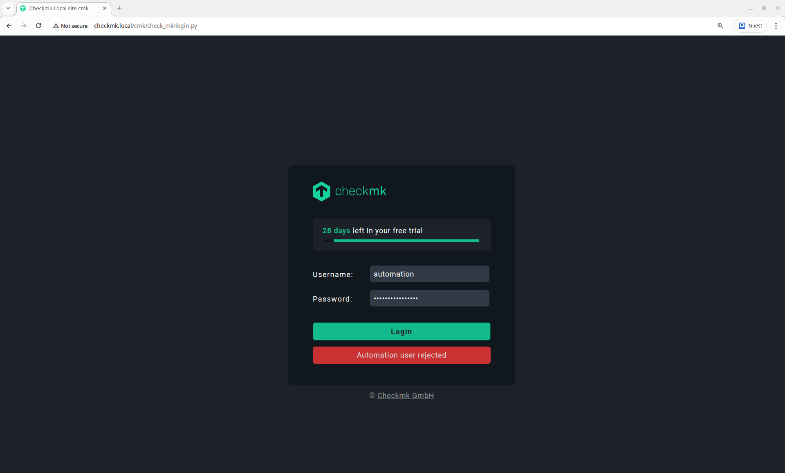
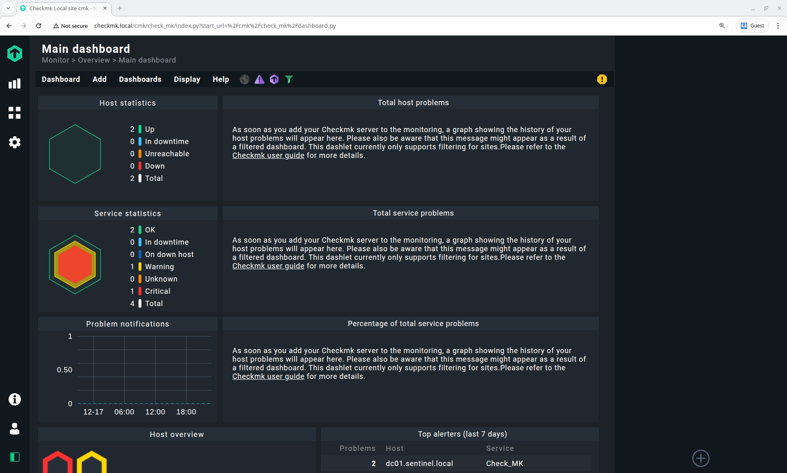
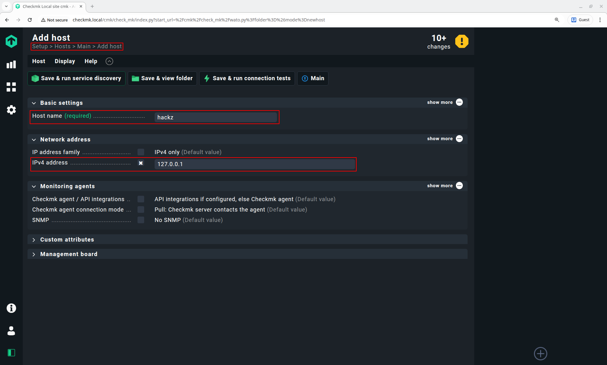
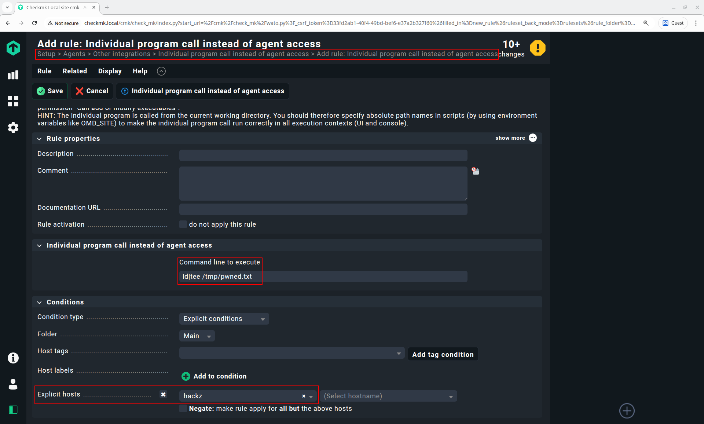
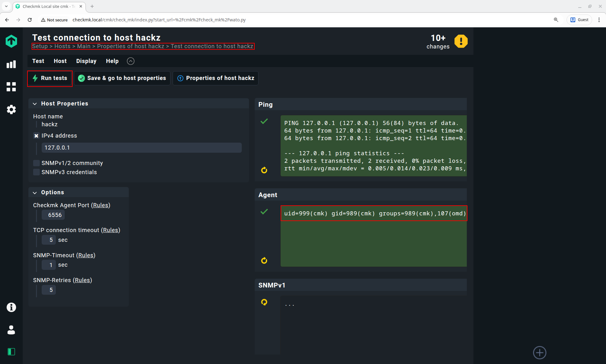
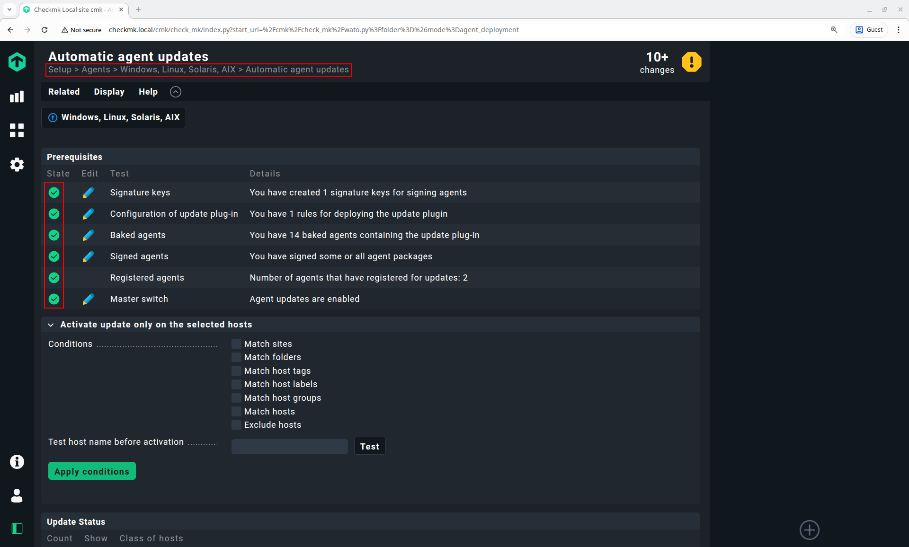
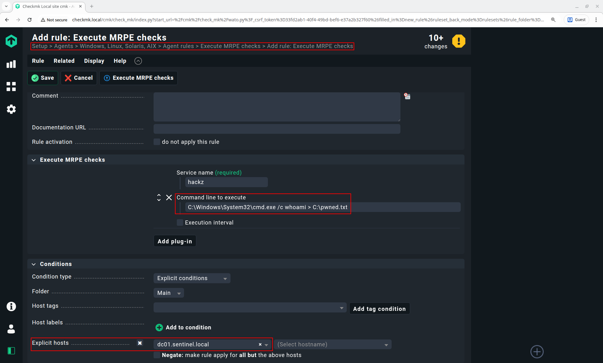
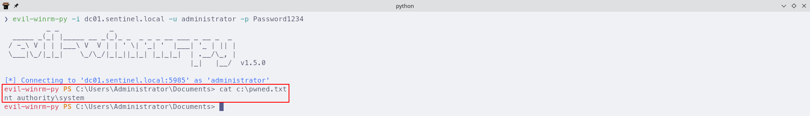

During a pentest a few weeks ago, I had the opportunity to take a closer look at [Checkmk](https://checkmk.com/).
Checkmk is an agent-based monitoring system in which the server pulls monitoring data from its agents via TCP port 6556.
And as it turned out during the assessment, Checkmk has several interesting features, that make it an attractive target for attackers.

# Automation User to Admin

It all started with the discovery of Checkmk credentials in the shell history of a Linux server.
When I entered these credentials in the web UI, I got an error message stating that my automation user was rejected.
Notably, entering a different password resulted in an "incorrect username or password" error.
So the credentials seemed valid, but probably only for API access.

Fortunately, Checkmk provides an OpenAPI specification and Swagger UI for its [REST API](https://docs.checkmk.com/latest/en/rest_api.html#rest_api_gui).
This made it relatively straightforward to create my own admin account.

~~~ bash
cat << EOF > ./user.json
{
  "username": "hacker",
  "fullname": "Hacker",
  "auth_option": {
    "auth_type": "password",
    "password": "$(uuidgen -r)"
  },
  "disable_login": false,
  "roles": ["admin"]
}
EOF
curl -sSfk https://checkmk.local/cmk/check_mk/api/1.0/domain-types/user_config/collections/all -H "Authorization: Bearer automation $password" --json @user.json
~~~

With this new account I could now access the web interface.

# Admin to Host

Checkmk provides several interesting features to admins.
One of them are so called *Extension Packages*.
These can be installed server- or agent-side.
But while I was tinkering with a custom package, I found a much easier way to obtain command execution on the underlying Linux server:

First, you create a new host by going to `Settings/Hosts/Add host`.
There you can leave everything at default, but you should specify an IP address to avoid connection errors in later steps.

Then go to `Settings/Other integrations`, select `Individual program call instead of agent access` and click `Add rule`.
There you find the option `Command line to execute` where you can enter your payload.
Before you click `Save` you should specify the host you created in the previous step under `Explicit hosts`.

To trigger execution of the payload, go back to `Settings/Hosts`, click on your host and click `Save & run connection tests`.

And tadaaa, RCE as *cmk* user 🎉

# Admin to External System

Checkmk has built-in support for a wide range of products, and even more are supported through third-party extensions.
The credentials for these external systems are stored in Checkmk's password store.
And now that I had code execution on the Checkmk host, I could extract and decrypt these credentials.
During the pentest, I was fortunate enough to find high-privileged credentials for a VMware vCenter in there.

~~~ bash
for p in /omd/sites/*/bin/python3; do
  $p -c "import cmk.utils.password_store as s,json;print(json.dumps(s.load(s.pending_password_store_path())))"
done
~~~

Weirdly enough, I could not reach the vCenter from the Checkmk server, despite the fact that monitoring data was coming in from said vCenter.
While I started to question my sanity, the customer's contact person told me about a second Checkmk instance.

# Admin to Remote Site

Checkmk can be set up in a *Distributed Monitoring* mode with a single central site and one ore more remote sites.
In this setup the central site has full control over the remote sites and configuration changes on the central site are pushed to the remote sites.

It turned out that the Checkmk server, that I initially compromised, is the central site and the second Checkmk instance is a remote site.
Furthermore, the web interface of the remote site was reachable from the first server.
As expected, I could log in with my admin credentials on the remote site, but the remote site was running in some kind of read-only mode, so I could not gain RCE through the custom integration again.

After reading more documentation, I found the configuration page `Settings/Distributed monitoring` and saw that the option `Disable remote configuration` was enabled for the remote site.
Disabling this option and applying the configuration change through the yellow exclamation mark in the top right corner brought the remote site into a read-write state and subsequently allowed me to obtain a remote shell on the second server.  
Finally, I could start a SOCKS proxy there and access the vCenter.
And as admin on the vCenter I went the usual route, created a snapshot of a domain controller, downloaded the memory image and extracted the computer account credentials with [memprocfs](https://github.com/ufrisk/memprocfs).
With that, I had reached my goal for the pentest, but Checkmk had one more interesting feature, which I decided to explore further in my lab.

# Admin to Agent

Checkmk Enterprise brings a very neat feature called *Agent Bakery*.
It allows the Checkmk server to distribute application and configuration updates to its monitoring agents through agent installation packages.
These packages are signed with a password-protected key that is stored on the Checkmk server and verified by the agents before installing an update.
Admins must enter this password each time they want to roll out an update.

With code execution on the underlying Linux server it would probably be possible to backdoor the build process itself, but I found a way to gain code execution on an agent just via configuration changes in the web UI:

First, go to `Settings/Windows, Linux, Solaris, AIX`, select `Agents/Automatic agent updates` in the menu bar and verify that Checkmk is actually configured to roll out updates automatically.
Afterwards go back to the previous page.

Back at `Settings/Windows, Linux, Solaris, AIX` select `Agent rules` in the menu bar, then select `Execute MRPE checks` and finally `Add rule`.
There, click `Add plug-in` and specify a `Service name` and `Command line to execute`.
Then configure the system you want to target, e.g. a domain controller, under `Explicit hosts`.
If you are targeting a Windows agent, the command line must start with an absolute program path.

Finally, click on the yellow exclamation mark in the top right corner and click `Activate on selected sites`.
If you know the signing password you can now go to `Settings/Windows, Linux, Solaris, AIX` and click `Bake and sign agents`.
Otherwise wait until an admin distributes your changes with the next routine update.
Shortly after the monitoring agent installs the update, your command will be executed as *NT Authority\System* 🥳

